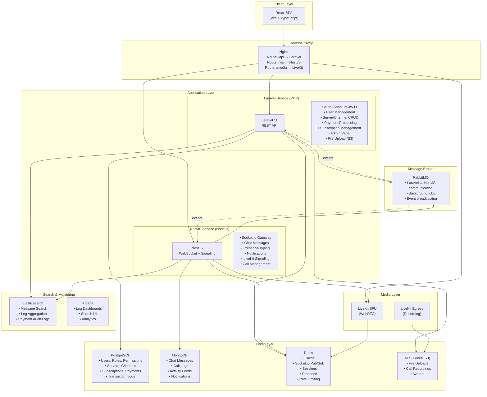
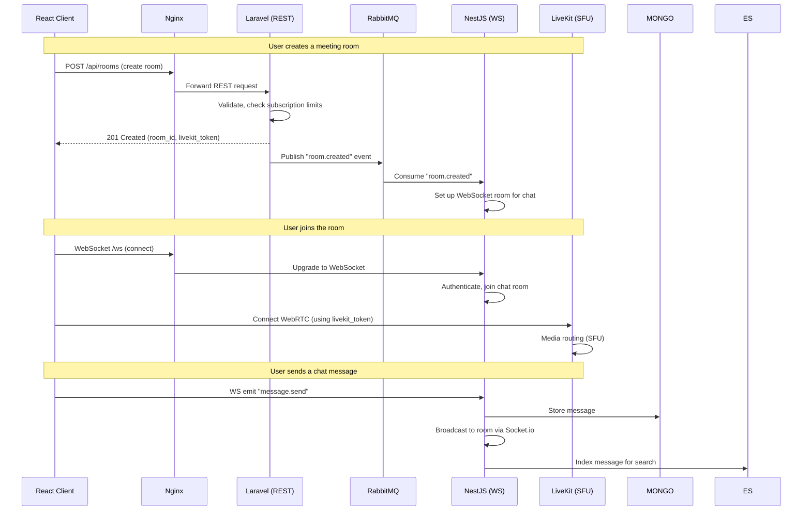
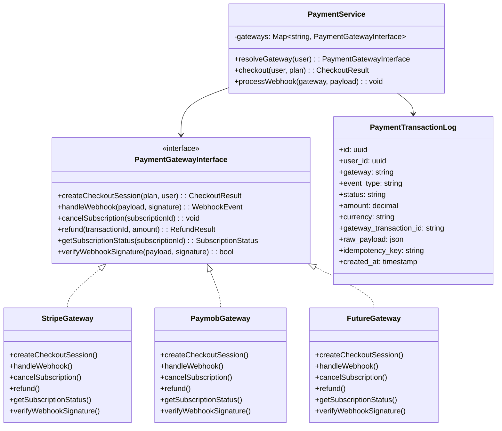
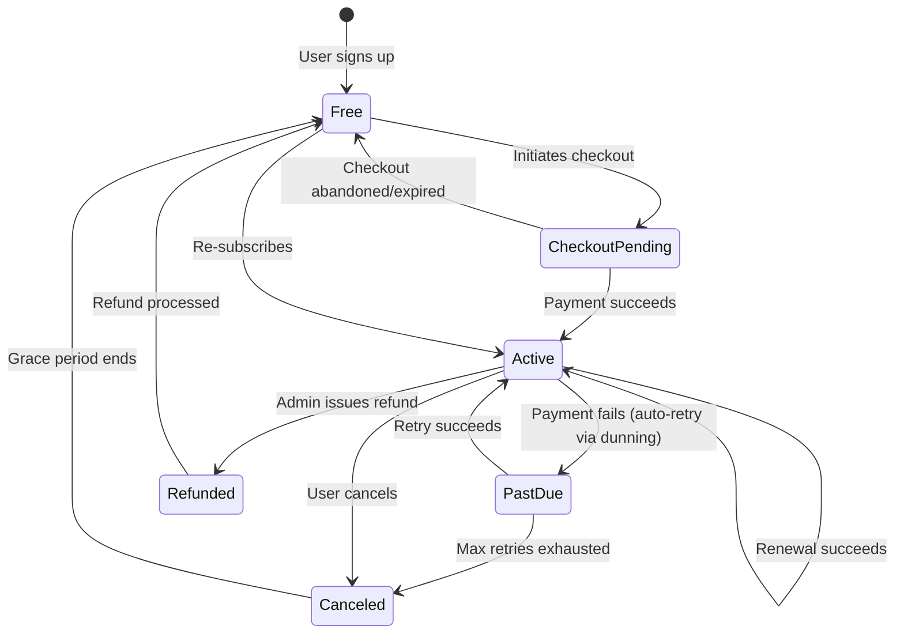

# Streaming & Communication Platform — Finalized Architecture Plan

## Confirmed Technology Decisions

| # | Decision | Your Choice | Notes |
|---|---|---|---|
| 1 | Backend Framework | **Laravel (REST API) + NestJS (WebSocket/Media Microservice)** | Mixed — each does what it's best at |
| 2 | Database | **PostgreSQL + MongoDB** | PG for transactional, Mongo for messages |
| 3 | Media Server | **LiveKit** | Self-hosted locally via Docker, cloud for production |
| 4 | WebSocket Layer | **NestJS + Socket.io + Redis Adapter** | Lives in the NestJS microservice |
| 5 | Redis | **Multi-role** (cache, pub/sub, sessions, presence) | Local Redis via Docker |
| 6 | Message Queue | **RabbitMQ** | Full-featured message broker |
| 7 | Search & Logging | **Elasticsearch + Kibana** | Self-hosted ELK stack |
| 8 | Orchestration | **Docker Compose (local) + EKS (production)** | Everything containerized |
| 9 | Payment Gateway | **Stripe + Paymob + extensible gateway abstraction** | Strategy pattern for unlimited gateways |
| 10 | Frontend | **React** | SPA, communicates via REST + WebSocket |

---

## High-Level Architecture



---

## Service Communication Pattern

The two backends (Laravel + NestJS) need to communicate. Here's how:



---

## Payment Gateway Abstraction (Strategy Pattern)

> [!IMPORTANT]
> You want **extensible multi-gateway** support — not just Stripe + Paymob, but the ability to add any payment provider in the future. Here's the design:

### Architecture



### How Adding a New Gateway Works

1. Create a new class implementing `PaymentGatewayInterface` (e.g., `PayPalGateway`, `TapGateway`, `FawryGateway`)
2. Register it in the `PaymentService` gateway map
3. Add a webhook route: `POST /api/webhooks/{gateway}` — the gateway name routes to the correct handler
4. **No changes to existing code** — Open/Closed Principle

### Subscription State Machine



### Transaction Logging (Audit Trail)

Every payment event is logged to **both** PostgreSQL (structured, queryable) and Elasticsearch (searchable, analytics):

```
payment_transaction_logs table (PostgreSQL):
├── id (UUID)
├── user_id (FK)
├── gateway (enum: stripe, paymob, paypal, ...)
├── event_type (checkout.created, payment.succeeded, subscription.renewed, ...)
├── status (pending, succeeded, failed, refunded)
├── amount (decimal)
├── currency (string)
├── gateway_transaction_id (string)
├── gateway_subscription_id (string)
├── raw_payload (JSONB — full webhook payload for debugging)
├── idempotency_key (string — prevent duplicate processing)
├── ip_address (string)
├── metadata (JSONB — extra context)
├── created_at (timestamp)
└── updated_at (timestamp)
```

---

## Docker Compose Local Development

All services run locally via `docker-compose.yml`:

| Service | Container | Port |
|---|---|---|
| Laravel API | `php:8.3-fpm` + Nginx | `8000` |
| NestJS Service | `node:20-alpine` | `3000` |
| React Frontend | `node:20-alpine` (Vite dev) | `5173` |
| PostgreSQL | `postgres:16` | `5432` |
| MongoDB | `mongo:7` | `27017` |
| Redis | `redis:7-alpine` | `6379` |
| RabbitMQ | `rabbitmq:3-management` | `5672` / `15672` (UI) |
| Elasticsearch | `elasticsearch:8.15` | `9200` |
| Kibana | `kibana:8.15` | `5601` |
| LiveKit | `livekit/livekit-server` | `7880` / `7881` |
| MinIO (S3) | `minio/minio` | `9000` / `9001` (UI) |
| Nginx (proxy) | `nginx:alpine` | `80` |

> [!NOTE]
> **System Requirements for running all services locally:**
> - RAM: At minimum **16GB**, recommended **32GB** (Elasticsearch alone needs 2-4GB)
> - CPU: 4+ cores recommended
> - Disk: ~10GB for Docker images + data volumes
> - Docker Desktop with WSL2 enabled (Windows)

---

## Project Phases (Detailed Breakdown)

### Phase 1: Foundation & Infrastructure
**Goal:** Project scaffolding, Docker environment, databases, basic auth

| Deliverable | Details |
|---|---|
| Docker Compose | All 12 services running locally with one `docker-compose up` |
| Laravel project | Laravel 11, configured for PostgreSQL, Redis, RabbitMQ |
| NestJS project | NestJS with Socket.io, configured for MongoDB, Redis, RabbitMQ |
| React project | Vite + React + TypeScript, API client setup |
| Database schemas | PostgreSQL migrations (users, servers, channels, roles) |
| Authentication | JWT-based auth (Laravel issues tokens, NestJS validates them via shared secret) |
| Shared auth | Both services validate the same JWT tokens |

---

### Phase 2: Servers & Channels (Discord-style)
**Goal:** Users can create servers, channels, manage members and roles

| Deliverable | Details |
|---|---|
| Server CRUD | Create, update, delete servers. Server settings, icons. |
| Channel CRUD | Text channels, voice channels within servers |
| Roles & Permissions | Role-based access (admin, moderator, member). Channel-level permissions. |
| Invites | Generate invite links, join servers via invite |
| Member management | Kick, ban, role assignment |

---

### Phase 3: Real-Time Chat
**Goal:** Live text chat in channels and DMs

| Deliverable | Details |
|---|---|
| Socket.io connection | Client connects to NestJS, authenticates via JWT |
| Channel messages | Send/receive messages in real-time. Store in MongoDB. |
| Direct Messages | 1:1 DMs between users |
| Typing indicators | "User is typing..." via presence |
| Online/offline status | Track user presence via Redis |
| Message features | Edit, delete, reply, reactions, file attachments |
| Message history | Paginated message loading (cursor-based) |

---

### Phase 4: Video/Audio Calls (LiveKit)
**Goal:** 1:1 and group video/audio calls with screen sharing and recording

| Deliverable | Details |
|---|---|
| LiveKit integration | Generate room tokens, manage rooms via LiveKit API |
| Join/leave calls | Users join voice channels → auto-connect to LiveKit room |
| Screen sharing | Share screen/window via LiveKit SDK |
| Call recording | Record calls via LiveKit Egress → save to MinIO/S3 |
| Room types | Small (1:1, up to 10), Medium (up to 50), Large (up to 100+) |
| Call controls | Mute, deafen, camera toggle, speaker selection |
| Meeting duration limits | Free users: 45 min. Subscribers: unlimited. Timer + warnings. |

---

### Phase 5: Payment System
**Goal:** Complete subscription lifecycle with multi-gateway support

| Deliverable | Details |
|---|---|
| Payment gateway abstraction | `PaymentGatewayInterface` + Strategy pattern |
| Stripe integration | Full lifecycle: checkout, webhooks, subscription management |
| Paymob integration | Same interface, different implementation |
| Subscription plans | Free tier, Pro, Enterprise — stored in PostgreSQL |
| Webhook handling | Secure (signature verification), idempotent (dedup by event ID) |
| Transaction logging | Every event logged to PG + Elasticsearch for auditing |
| Subscription state machine | All states from the diagram above |
| Dunning (failed payments) | Auto-retry logic, user notifications, grace period |
| Refunds | Admin-initiated refunds via gateway API |
| Billing portal | Users can view invoices, update payment method, cancel |

---

### Phase 6: Search & ELK Stack
**Goal:** Full-text search across messages + centralized logging

| Deliverable | Details |
|---|---|
| Elasticsearch indices | Messages index, logs index, payment audit index |
| Message search | Search messages across channels/DMs with filters |
| Log pipeline | Structured JSON logs from Laravel + NestJS → Filebeat → Elasticsearch |
| Kibana dashboards | Error rates, API latency, payment metrics, user activity |
| Payment audit dashboard | All transactions searchable by user, gateway, status, date |

---

### Phase 7: Notifications
**Goal:** Real-time in-app + email + push notifications

| Deliverable | Details |
|---|---|
| In-app notifications | Via Socket.io — mentions, DMs, server invites |
| Email notifications | Via RabbitMQ worker — welcome, payment receipts, failed payment warnings |
| Push notifications | FCM (Android) + APNs (iOS) for mobile — future-ready |
| Notification preferences | Users control what they receive and how |

---

### Phase 8: Scaling & Monitoring
**Goal:** Production-ready infrastructure with observability

| Deliverable | Details |
|---|---|
| Kubernetes manifests | EKS deployment configs for all services |
| Helm charts | LiveKit, Elasticsearch, RabbitMQ via official Helm charts |
| Prometheus + Grafana | Metrics collection, dashboards, alerting |
| Auto-scaling | HPA (Horizontal Pod Autoscaler) for API + WebSocket pods |
| Load testing | k6 or Artillery — validate 10K concurrent users |
| CDN | CloudFront for static assets + media |

---

### Phase 9: Polish & Launch
**Goal:** Security hardening, error handling, CI/CD

| Deliverable | Details |
|---|---|
| Rate limiting | Per-user, per-IP rate limiting on all APIs |
| Security audit | OWASP checks, CORS, CSP headers, input sanitization |
| Error handling | Global exception handlers, user-friendly error responses |
| CI/CD | GitHub Actions — lint, test, build, deploy to EKS |
| Documentation | API docs (Swagger), deployment guide, runbook |

---

## Folder/Service Structure Preview

```
streaming-platform/
├── docker-compose.yml              # All services
├── .env.example                    # Environment variables
│
├── backend/                        # Laravel (REST API)
│   ├── app/
│   │   ├── Http/Controllers/
│   │   ├── Models/
│   │   ├── Services/
│   │   │   ├── Payment/
│   │   │   │   ├── PaymentGatewayInterface.php
│   │   │   │   ├── PaymentService.php
│   │   │   │   ├── Gateways/
│   │   │   │   │   ├── StripeGateway.php
│   │   │   │   │   ├── PaymobGateway.php
│   │   │   │   │   └── ... (add more gateways)
│   │   │   │   └── DTOs/
│   │   │   └── ...
│   │   ├── Events/                 # Events published to RabbitMQ
│   │   └── Listeners/             # Events consumed from RabbitMQ
│   ├── database/migrations/
│   ├── routes/api.php
│   └── Dockerfile
│
├── realtime/                       # NestJS (WebSocket + Media Signaling)
│   ├── src/
│   │   ├── chat/                   # Chat module
│   │   ├── presence/               # Online/typing status
│   │   ├── notifications/          # Real-time notifications
│   │   ├── livekit/                # LiveKit signaling
│   │   ├── rabbitmq/               # RabbitMQ consumers
│   │   └── common/                 # Shared auth, guards, DTOs
│   └── Dockerfile
│
├── frontend/                       # React (Vite + TypeScript)
│   ├── src/
│   │   ├── components/
│   │   ├── pages/
│   │   ├── hooks/
│   │   ├── services/               # API client + WebSocket client
│   │   └── stores/                 # State management (Zustand/Redux)
│   └── Dockerfile
│
├── nginx/                          # Reverse proxy config
│   └── nginx.conf
│
├── elk/                            # Elasticsearch + Kibana configs
│   ├── elasticsearch.yml
│   └── kibana.yml
│
├── k8s/                            # Kubernetes manifests (Phase 8)
│   ├── backend/
│   ├── realtime/
│   ├── livekit/
│   └── monitoring/
│
├── ARCHITECTURE.md                 # This document (committed to repo)
├── PROJECT_STRUCTURE.md            # Detailed folder breakdown
└── README.md
```

---

## Your Approval Needed

> [!IMPORTANT]
> All 9 decisions are confirmed. Before I start **Phase 1** implementation, please confirm:
>
> 1. ✅ Are you happy with the **architecture diagram** and service communication pattern?
> 2. ✅ Does the **payment gateway abstraction** (Strategy pattern) meet your extensibility requirements?
> 3. ✅ Are the **9 phases** and their ordering correct?
> 4. ✅ Do you have **Docker Desktop** installed and running on your PC?
> 5. ✅ Any changes before we start coding?

